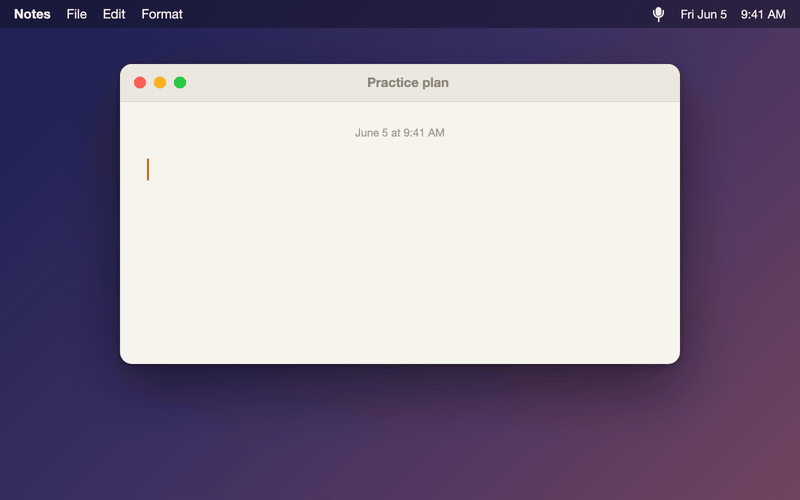

<div align="center">

# JVoice

**Free, open-source voice dictation for macOS. 100% on-device. No subscription, no cloud, no accounts.**

<!-- DEMO GIF GOES HERE — hosted on GitHub CDN, ~10s: hotkey → speak → text appears -->


Press <kbd>⌥ Option</kbd>+<kbd>Space</kbd> anywhere, talk, and clean, tone-styled text lands at your cursor — in any app.

[Download](https://github.com/USER/jvoice/releases/latest) · [First launch on macOS](#first-launch-on-macos) · [Build from source](#build-from-source)

</div>

---

## Why JVoice

Dictation tools like Wispr Flow and superwhisper cost $8–15/month for something your Mac can do by itself. JVoice runs [WhisperKit](https://github.com/argmaxinc/WhisperKit) locally on Apple Silicon — your voice never leaves your machine, and it costs nothing, forever.

- 🎙️ **System-wide dictation** — global hotkey (<kbd>⌥Space</kbd>), works in any app: Messages, Mail, Docs, your IDE
- 🧠 **On-device Whisper** — choose tiny → large-turbo models depending on your Mac; nothing is sent anywhere
- ✍️ **Tone styles** — Casual, Formal, or Very Casual: JVoice rewrites your rambling into the register you want
- 🧹 **Filler-word removal** — "um", "uh", "like" are gone before the text lands
- 📖 **Custom dictionary** — teach it your name, your school, your project names. Words aren't just find-replaced afterwards: they bias Whisper itself at recognition time, and a phonetic matcher catches the mishearings that slip through ("jay voice" → "JVoice")
- 🎧 **Headphone-friendly** — keeps Bluetooth audio quality intact by routing recording to the built-in mic
- 📊 **Stats** — total words dictated and average WPM (you talk ~3× faster than you type)
- 🌍 **English & Romanian** (more languages easy to add — Whisper supports ~100)

## Privacy

- **Zero network calls** during use. The only download ever is the Whisper model itself (fetched once from Hugging Face on first run).
- No telemetry, no analytics, no accounts, no launch-at-startup surprises.
- Open source — read the code, build it yourself.

## Install

1. Download `JVoice.dmg` from the [latest release](https://github.com/USER/jvoice/releases/latest) and drag **JVoice** into **Applications**.
2. See [First launch on macOS](#first-launch-on-macos) below — one extra step because this is a free, unsigned app.

### First launch on macOS

JVoice is free and isn't notarized by Apple (that requires a $99/yr developer subscription). macOS will warn you once:

1. Open JVoice. macOS says it *"can't verify the developer."* Click **Done** (not "Move to Trash").
2. Open **System Settings → Privacy & Security**, scroll to the bottom, and click **Open Anyway** next to JVoice.
3. Enter your password, open JVoice again, and click **Open**. That's it — you'll never see the warning again.

> If you instead see *"JVoice is damaged"*, run this once in Terminal:
> `xattr -dr com.apple.quarantine /Applications/JVoice.app`

On first run JVoice asks for **Microphone** (to hear you) and **Accessibility** (to type the text into the frontmost app) permissions, then downloads your chosen Whisper model.

## Usage

1. Press <kbd>⌥Space</kbd> — a recording pill appears.
2. Talk. Press <kbd>⌥Space</kbd> again to stop.
3. Transcribed, tone-styled text is pasted at your cursor.

Settings (menu bar icon → Settings…): language, tone style, Whisper model, filler-word removal, custom words, and your dictation stats. Your 30 most recent transcripts are kept in Settings too — copy any one back to the clipboard, or clear them. Everything stays on your Mac.

## Build from source

Don't trust an unsigned binary? Good instinct — build it yourself:

```bash
git clone https://github.com/USER/jvoice && cd jvoice
swift build -c release
./scripts/install.sh   # builds, signs locally, installs to /Applications
```

Requires macOS 14+, Apple Silicon recommended, Xcode Command Line Tools only (no Xcode needed).

## Support the project

JVoice is free forever. If it saves you a subscription, a ⭐ on this repo is the best way to help others find it.

## License

GPL-3.0 — free to use, build, and modify; derivatives must stay open.
